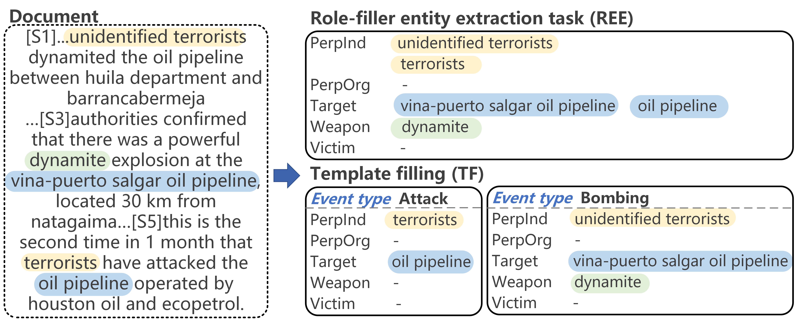

# RTG4TE
Source code for the paper: Retrieval-enhanced Template Generation for Template Extraction (NLPCC 2024)

## Overview


An example of template extraction. A generic template is extracted for document-level REE task. Two event templates including an `Attack` event template and a `Bombing` event template are extracted for TF task.

All the required packages are listed in `requirements.txt`. To install all the dependencies, run

```
pip install -r requirements.txt
```


## Data
For TF task, we downloaded the original dataset from [GTT](https://github.com/xinyadu/gtt). The extracted train, dev, and test files are located in `data/tf/`. 
These original data are transformed into our internal format using `convert_tf.py`.
```
python convert_tf.py --input_path data/train.json --output_path data/tf_train.json
```

AS for REE task, we downloaded the original dataset from [GRIT](https://github.com/xinyadu/grit_doc_event_entity/). The extracted train, dev, and test files are located in `data/ree/`. 
These original data are transformed into our internal format using `convert_grit.py`.

```
python convert_grit.py --input_path data/grit_train.json --output_path data/ree_train.json
```

## Usage
Template Filling
```
python train.py -c config/tf_generative_model.json
```

Role-filler entity extraction
```
python train.py -c config/ree_generative_model.json
```

## Acknowledgement

We refer to the code of [TempGen](https://github.com/PlusLabNLP/TempGen). Thanks for their contributions.
## Citation


